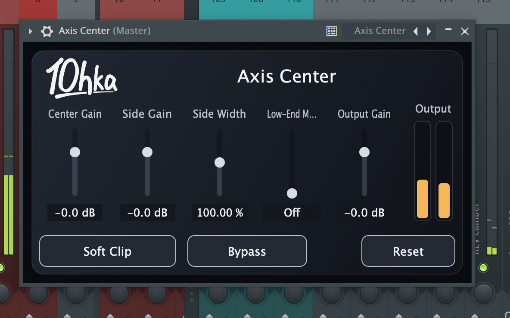

# Axis Center

JUCE/C++で実装した、シンプルなMid/SideベースのステレオVST3プラグインです。

## スクリーンショット



## 機能

- ステレオ入力 / ステレオ出力
- `Mid = (L + R) * 0.5`
- `Side = (L - R) * 0.5`
- `Center Gain` を Mid に適用
- `Side Gain` と `Side Width` を Side に適用
- `Low-End Mono` が有効な場合、指定周波数以下の Side 成分を1次ハイパスで減衰
- `Output Gain`
- `Soft Clip` のオン/オフ
- `Bypass` のオン/オフ

## パラメータ

- Center Gain: `-24` から `+12 dB`
- Side Gain: `-24` から `+12 dB`
- Side Width: `0` から `200 %`
- Low-End Mono: `Off` または `20` から `300 Hz`
- Output Gain: `-24` から `+12 dB`
- Soft Clip: on/off
- Bypass: on/off

## ビルド

macOSでJUCEを使ってVST3をビルドします。ローカルにJUCEを持っている場合は、`/path/to/JUCE` を実際のJUCEパスに置き換えて次を実行します。

```bash
cmake -B build -DJUCE_DIR=/path/to/JUCE
cmake --build build --config Release
```

または環境変数を使えます:

```bash
export JUCE_DIR=/path/to/JUCE
cmake -B build
cmake --build build --config Release
```

JUCEをローカル配置せず、CMakeに取得させることもできます。

`JUCE_DIR` を指定しない場合、CMakeはJUCEをGitHubから取得します。

```bash
cmake -B build
cmake --build build --config Release
```

VST3は `build/AxisCenter_artefacts` 以下に生成されます。

macOSでは、`AxisCenter_VST3` のビルド完了後に `~/Library/Audio/Plug-Ins/VST3/Axis Center.vst3` へ自動で上書き配置されます。

## リリース運用

このリポジトリでは、`master` を開発ブランチ、`release` をリリース集約ブランチとして扱います。

```text
feature/* -> master -> release
```

- 通常開発は `feature/* -> master` の PR で進める
- リリース時に `master -> release` の集約 PR を作る
- 集約 PR のタイトルは `v0.X.Xのreleaseまとめ` の形式にそろえる
- `release` へ merge されたら GitHub Actions が patch version を自動加算し、tag、build、GitHub Release 作成まで実行する

`VERSION` ファイルを単一の真実源として扱い、CMake、VST メタデータ、GUI 表示、GitHub Release のバージョンを一致させます。
